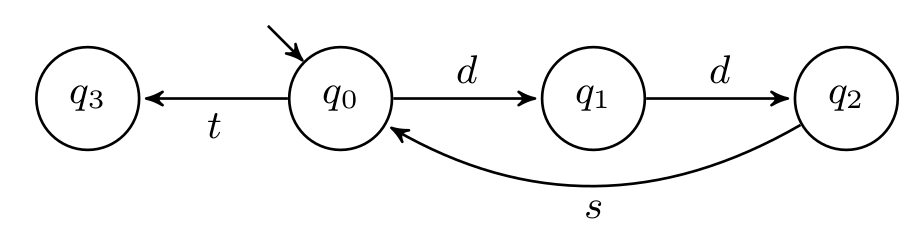
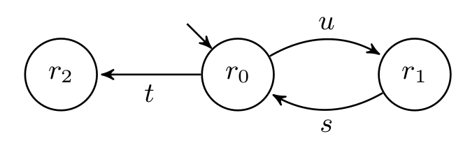
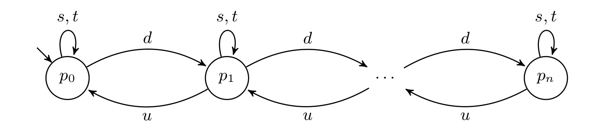
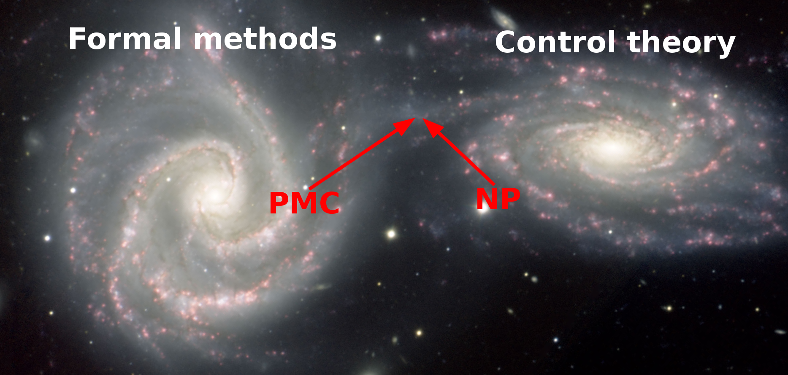
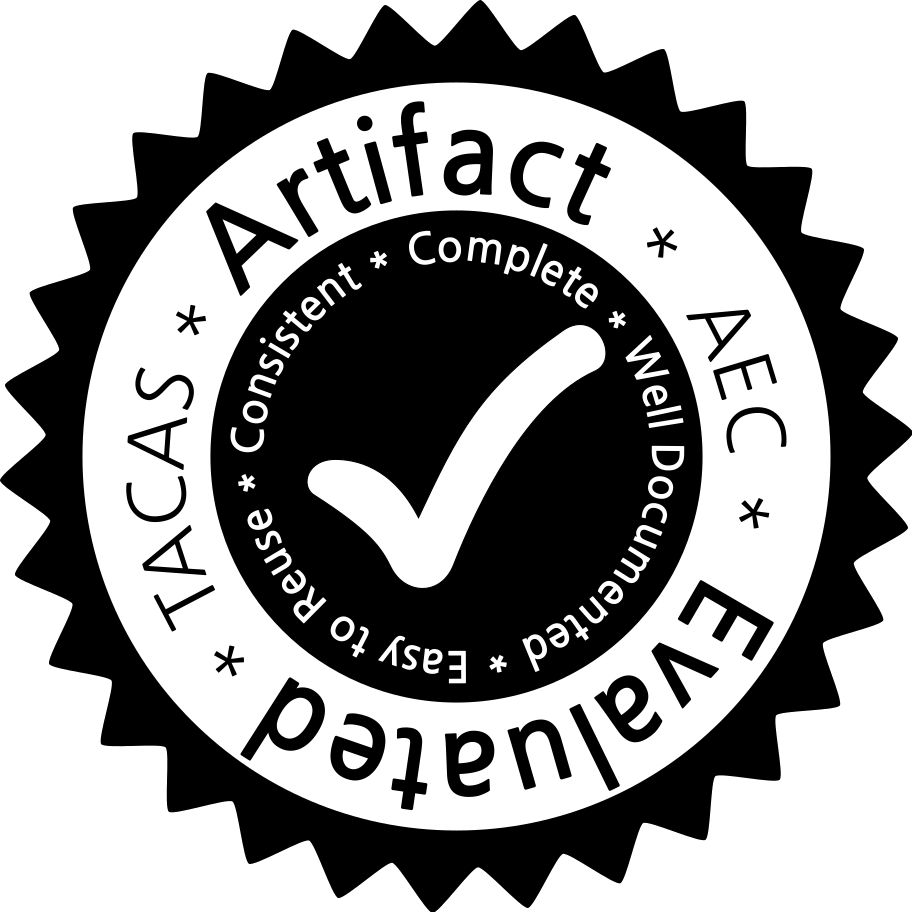
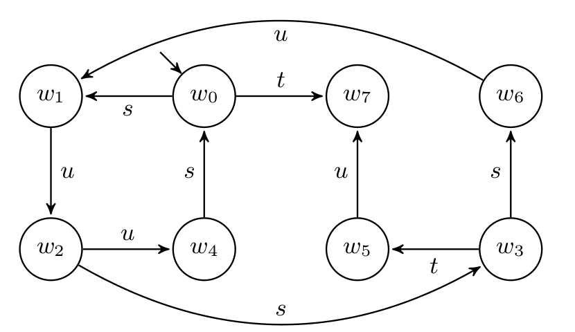
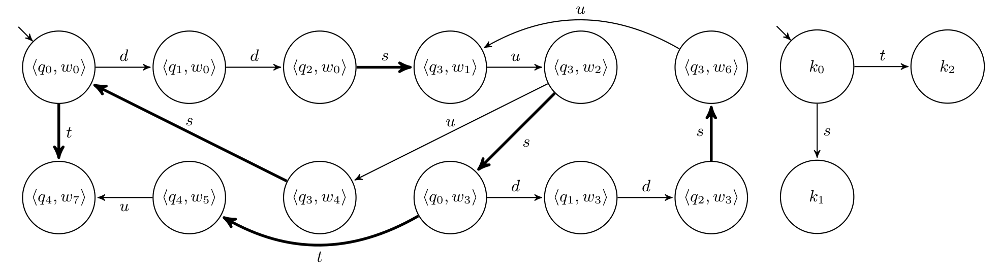

## From natural projection to partial model checking and back

__**Gabriele Costa**__, Letterio Galletta (IMT Lucca)

David Basin (ETH Zurich)

Chiara Bodei, Pierpaolo Degano (University of Pisa)

---
### Outline

- Problem overview
- Partial model checking vs. natural projection
- A new quotienting algorithm and tool
- Conclusion and future work

*See this presentation at [https://goo.gl/R9MXhr](https://gitpitch.com/SCPTeam/pests)*

---
### Composition (A|B)

Given two transition systems A and B, their (parallel) composition has
- a state for each pair of A's and B's states
- an initial/final state for each pair of initial/final states
- *synchronous* transitions on common actions
- *asynchronous* transitions on the other actions

**Common in system modeling and analysis**

---

### Decomposition (A/B)

Given two transition systems A and B find X such that X|B = A

- **/** a.k.a. **quotienting** operator
- Less common but relevant for problems on interest
 - **Ex:** Sub-module construction (*SCP*) and controller synthesis (*CSP*)
- *X could not exist*

**Hard to solve in general**

---

### Example: Drone Package Delivery

Unmanned aerial vehicles (UAV) operating on a docking station

- **Adder `$A_n$`** repeatedly puts down $n$ items (action $d$) and sends a synchronous signal (action $s$). Eventually terminates with a synchronous action $t$

- **Remover `$B_n$`** repeatedly picks up (action $u$) $n$ items and synchronizes like A

- **Docking station `$P_n$`** has a limited, $n$-elements stack

---

### Example: Drone Package Delivery

**`$A_2$`**

**`$B_1$`**

---

### Example: Drone Package Delivery

**`$A_2 | B_1$`**

**`$P_n$`**

---

### Example: Drone Package Delivery

- Does `$A_2 | B_1$` satisfy `$P_2$` (in symbols `$A_2 | B_1 \models P_2$`)?
 - No! Counterexample: `$d d u s d d$`

- Given A, can we modify B to fulfil P? (SCP)

- Is there a controller C to enforce P on A | B? (CSP)

---

### Natural projection
`$\pi : 2^{\Sigma_0} \times \Sigma_0^\ast \rightarrow \Sigma_0^\ast$` [Wonham]

- `$\pi_\Sigma$` removes from $\sigma \in \Sigma_0^\ast$ any symbol not in $\Sigma \subseteq \Sigma_0$
 - **Ex:** `$\pi_{\{b,g,u\}}(bungabunga) = bugbug$`
- Can be extended to a language $\mathcal{L} \subseteq \Sigma_0^\ast$
 - **Ex:** `$\pi_{\{b,g,u\}}(bunga^\ast) = bug^\ast$`
- Several applications in the control theory community (e.g. SCP and CSP)

---

### Partial model checking
`$// : \Phi \times \mathbb{A} \rightarrow \Phi$` [Andersen]
- Given a ($\mu$-calculus) formula $\phi$ and a transition system A find $\phi' = \phi // A$ such that for all B

**Theorem:** `$A | B \models \phi$` iff `$B \models \phi'$`

- Several applications in the formal methods community (e.g. program refinement and monitoring)

---

### NP vs. PMC

| | NP | PMC |
|---|---|---|
| Agent | FSA | LTS |
| Specification | FSA | `$\mu K$` |
| Complexity | EXPTIME* | EXPTIME |
| Tools | TCT, IDES3, DESTool | mCRL2, CADP, MuDiv |

*: PTIME for a specific class of FSA

---

### Gravitational waves

**Control theory** and **formal methods** are colliding [Ehlers et al.]

---

### A common framework (1)

- We redefine NP to work with LTS agents and $\mu K$ specifications
 - Finite LTS $\sim$ FSA (with all accepting states)
 - Any FSA `$X$` can be encoded as a `$\mu K$` formula `$\phi_X$`
- A trace $\sigma$ is an alternation of states and actions
 - **Ex:** $q_0 d q_1 d q_2$ (rather than $d d$) is a trace of A$_2$

---

### A common framework (2)

Given two LTS $A$ and $B$, the **natural projection** on $A$ of a trace $\sigma$ of `$A|B$` is

- `$\pi_{A}(\langle s_A, s_B \rangle) = s_A$`
- `$\pi_{A}(\langle s_A, s_B \rangle a \langle s'_A, s'_B \rangle \cdot \sigma) = s_A a s'_A \cdot \pi_{A}({\sigma})$`
 - for any action `$a \in \Sigma_A$`
- `$\pi_{A}(\langle s_A, s_B \rangle b \langle s_A, s'_B \rangle \cdot \sigma) = \pi_{A}({\sigma})$`
 - for any *asynchronous* `$b \in \Sigma_B$`

*We extend `$\pi$` to languages*

---

### Theoretical results

*Encoding NP as PMC we can prove*

- **Theorem:** `$\mathcal{L}(\phi_P // A) = \pi_{B}(\mathcal{L}(P))$`
- **Theorem:** The following statements are equivalent
 1. `$ A|B \models P$`
 2. `$ A \models \phi_P // B$` (resp. B and A)
 3. `$\mathcal{L}(A) \subseteq \pi_{A}(\mathcal{L}(P))$` (resp. B)

---

### Practical results

- A new quotienting algorithm for LTS
 - Correct: finds the *most general* decomposition if it exists
 - Efficient: `$O(n^5)$` for *deterministic*`$^*$` LTS
   - Best NP algorithm: `$O(n^6)$` for *deterministic*`$^*$` FSA
- *PESTS*: a OS implementation working on FSA
 - [PESTS@github](https://github.com/SCPTeam/pests)
 - Also applied to  [FlexFact](http://www.rt.eei.uni-erlangen.de/FGdes/productionline.html), a real DES

---

### Back to the working example (Fix)

- `$P_2$` does not admit decomposition on `$A_2$`
 - Because one `$s$` is not enough
- Let `$A'_2$` be as follows

---

### Back to the working example (SCP)

Find the remover `$B_n$` (`$\Sigma_B = \{u, s, t\}$`) s.t. `$A'_2 | B_n \models P_n$`

**`$B_3$`: decomposition against `$P_3$`**

---

### Back to the working example (CSP)

Clearly `$A'_2 | B_3 \not\models P_2$`

Find the controller `$C$` (`$\Sigma_C = \{s,t\}$`) s.t. `$C | (A'_2 | B_3) \models P_2$`

---

### Conclusion

*Contributions*
- Under reasonable assumptions PMC `$\equiv$` NP
- A new algorithm and a tool for quotienting

*Future work*
- Extension: symbolic automata and MSO logic
- Application: verification and testing

---

**Thank you**

*Questions?*

---

### References

- [Andersen] H. R. Andersen, *Partial model checking*, 1999
- [Wonham] W. M. Wonham, *Supervisory control of discrete-event systems*, (online) 2017
- [Ehlers et al.] R. Ehlers, S. Lafortune, S. Tripakis, M. Vardi, *Bridging
the Gap between Supervisory Control and Reactive Synthesis: Case of Full Observation and Centralized Control*, 2014
